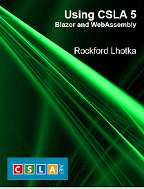

# Using CSLA 5: Blazor and WebAssembly Code

This repository contains the example/sample code from the [Using CSLA: Blazor and CSLA .NET](https://store.lhotka.net/using-csla-5-blazor-and-webassembly) book by Rockford Lhotka.

Each directory contains a solution from the book.

